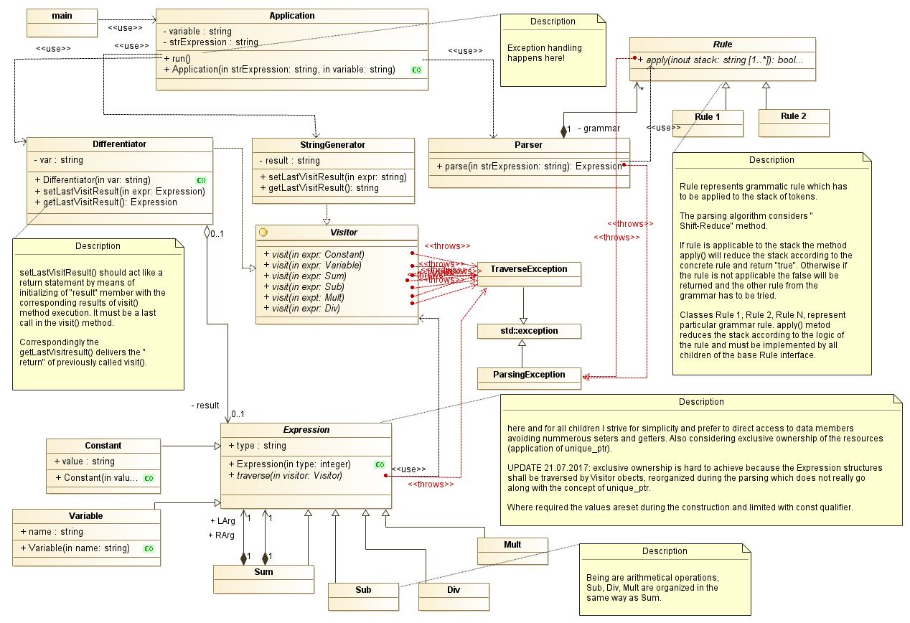
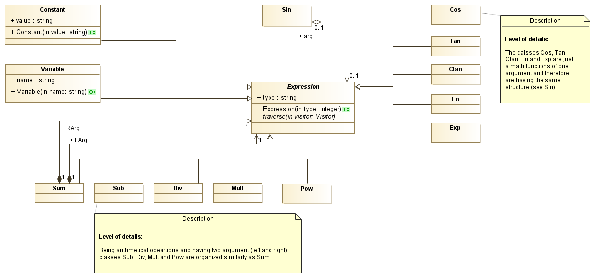
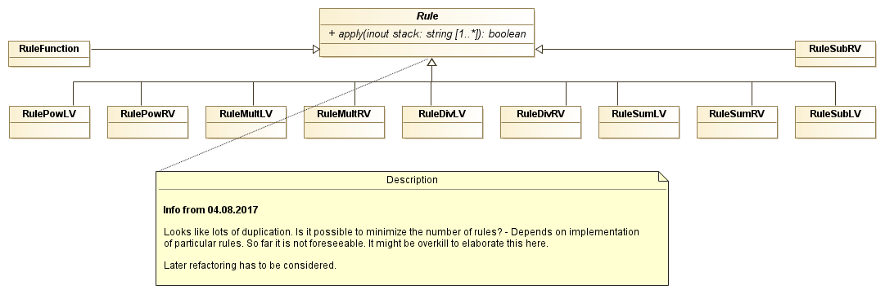

## The model of the application

The diagramm below depicts the more detailed model of the application.

As we can see the derived **Expression** types represent syntax tree elements.

The **Parser** implement parsing logic and operates with a grammar. The grammar is built of 
**Rule**s which are implementing certain [grammar](grammar.md) rules. The parser implements the 
"Shift-Reduce" method, at least some sort of it, because of simplicita of implementation. 
With this approach the high performance can't be anticipated, it is not a priority anyway.  

There are so far two **Visitor**s:
* **Differentiator** - actual differentiation of the expression, produces new instance of **Expresson**.
* **StringGenerator** generates the string representation of **Expression** hierarchies.

We also have **Application** object which handles interaction with user, provides entry point and performs error handling.

General class decomposition and relationships

The datails on syntax tree

The list of grammar rules

