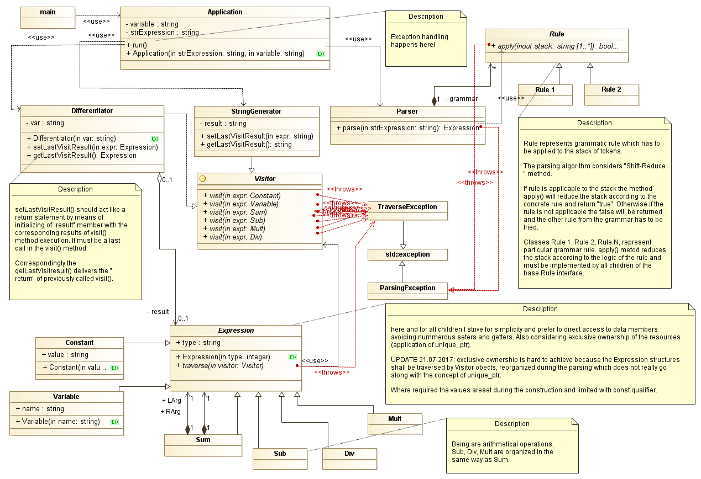

# Design notes

## Overview
Basically the application consists of the following basic blocks:

* **Parser** - accepts string expression and builds syntax tree
* **Syntax tree** - the hierarchical data structure representing the parsed expression. 
* **Visitors** are tools to perform operations over syntax tree: like differentiation or output in user-readable form.

## Basic considerations

* using c++14
* gcc + plain Makefiles
* smart pointers instead of explicit memory management.
* keep syntax tree element as simple as possible, PODs would be great
* -Wall -Werror -Wpedantic
* minimize inheretance, nevertheless it can be essential to use polymorphism in some way.
* exceptions instead of error codes

## The model of the application
The diagramm below depicts the more detailed model of the application.

As we can see the derived **Expression** types represent syntax tree elements.

The **Parser** implement parsing logic and operates with a grammar. The grammar is built of 
**Rule**s which are implementing certain [grammar](grammar.md) rules.

There are so far two **Visitor**s:
* **Differentiator** - actual differentiation of the expression, produces new instance of **Expresson**.
* **StringGenerator** generates the string representation of **Expression** hierarchies.

We also have **Application** object which handles interaction with user, provides entry point and performs error handling.



### Exception handling

Since no complex execution logic or sophisticated recovery after errors are considered, 
it is decided to to error handling on the level of **Application**.

The only one reasonable error handling here is just printing an error information to the user,
and this is the responsibility of **Application**.

## Unit testing
Yep, there are some test cases maintained during development.

Say ``` make clean all ``` and available tests will be run automatically during the build process.

The project incorporates [Google's C++ Test Framework](https://github.com/google/googletest "Google Test").

## What TO-be-DOne
- [x] Basic design
- [x] Implement basic design elements in code
- [ ] Clarifying and verifying the grammar (IN PROGRESS)
- [ ] Identify rules to be implemented
- [ ] Implementation of rules
- [ ] Implementation of Differentiator
- [ ] Implementation of StringGenerator
- [ ] Testing scripts fro whole application