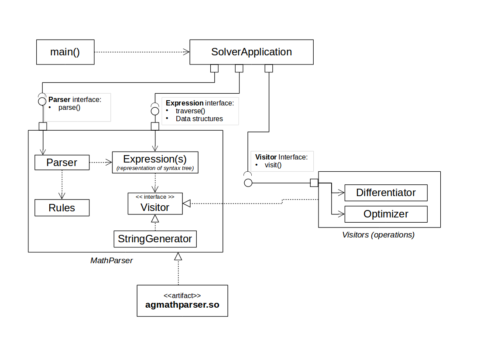
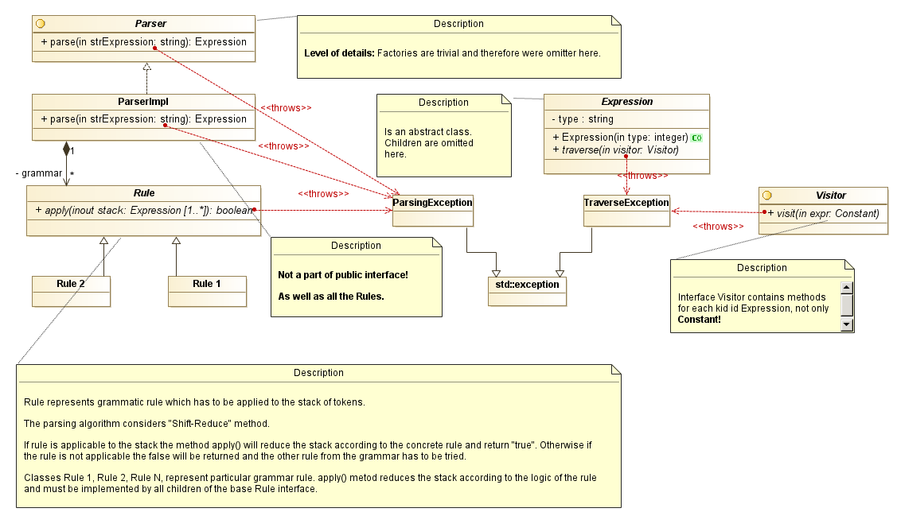
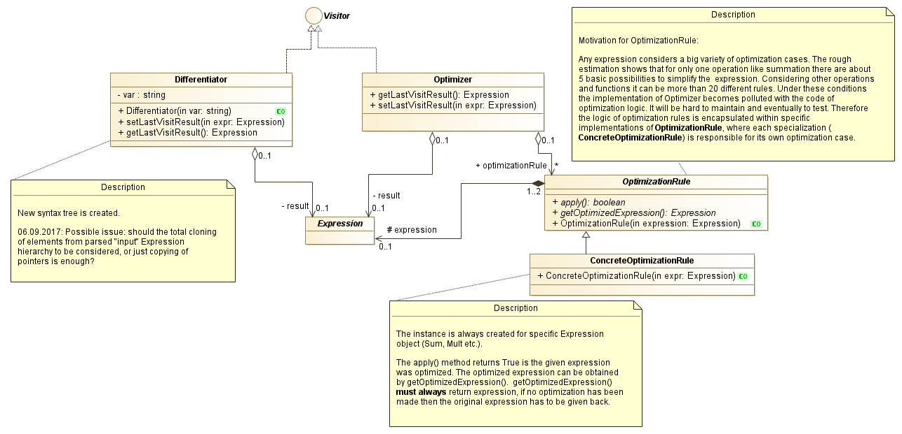

# Design notes

## Overview
Basically the application consists of the following elements:

* **SolverApplication** is the application object by itself. It is responsible 
for interaction with user and managing activities relevant for the user.
* **Parser** is responsible for parsing of the string input from user. 
It accepts string expression and builds syntax tree - the hierarchical data structure 
representing the parsed expression. This component provides the interface to parse 
the string, syntax tree and proposes the interface for custom operations to be performed with syntax tree.  
* **Visitors** are implementations of operations over syntax tree: like differentiation or output in user-readable form.

## Design goals and priorities
- Taste the c++ and get the experience with actual standards
- Keep design as clean as possible

## Technical constraints and considerations

* using of c++14
* gcc + plain Makefiles
* smart pointers instead of explicit memory management.
* keep syntax tree element as simple as possible, PODs would be great
* -Wall -Werror -Wpedantic
* minimize inheretance, nevertheless it can be essential to use it in some way.
* exceptions instead of error codes

## Design of the application

The design, as it usually happens, is evolving during the development. 
The initial model of the application are preserved here: [Initial design](initialDesign.md)
Here you can find the actual structure of the application. 

The basic elements of design, as it was mentioned above, are: application object, parser and visitors as operations.

The sequence of actions to be performed to differentiate an expression given by user is following:

No. | Activity                             | Component   | Input                  |  Output 
----|--------------------------------------|-------------|------------------------|---------------
1   | Get input from user                  | Application | Command line arguments | String
2   | Parse an expression from user        | Parser      | String from #1         | Syntax tree   
3   | Differentiate the expression         | Visitors    | Syntax tree from #2    | Syntax tree 
4   | Optimize ans simplify the expression | Visitors    | Syntax tree from #3    | Syntax tree 
5   | Get string representation of result  | Visitors    | Syntax tree from #4    | String 
6   | Print result                         | Application | String from #5         | Command line output 

The relationships between items and basic decomposition is provided on the picture below.



It is, for sure, a very coarse representation of the application structure. 

**SolverApplication** on this picture represent the application component.

The **Mathematical expression parser** component implements the parsing mechanism 
and exposes the interface to the application. It also provides the data structures 
representing the syntax tree (**Expression**) and predefines the interface (**Visitor**) to implement 
operations over this syntax tree like differentiation or optimitzation/simplification of the structure.

The component **Visitors (operations)** contains implementation of Visitor interface which is used by **SolverApplication**.

### Design of the Parser component

The **Parser** implement parsing logic according to the grammar. The grammar is built of 
**Rule**s which are implementing certain [grammar rules](grammar.md). The parser implements the 
"Shift-Reduce" method, at least some sort of it, because of the simplicity of implementation. 
With this approach the high performance can't be anticipated and it is not a priority so far.  

Detailed decomposition of this component into classes is provided on the picture below.



The parser can be viewed as independent entity and distributed in the form of library,
which can be eventually used by more than one application.

The digram below explains the structure of rules based on the [grammar description](grammar.md).


Rules are divided into two categories: ones that handle arythmetic operations with arguments on
both sides of operation sign and functions with one argument. Any other rule besides of these 
categories can be established by means of deriving a new class from **Rule** in order to preserve 
the interface, which allows extensions of Parser according to OCP. The order of rule execution 
is determined by the position in the **Parser::grammar** list. **IMPORTANT:** position in the grammar list
does not define the priority of operations!

"Syntax tree" is a data structure which represents the parsed expression. 
It has **Expression** as a base class and the following element are representing
syntax tree items.


### Design of the Visitors

The relationship between the **Visitor** and **Expression** is basically the classical 
Visitor design pattern, that maintainability advantages and adheres to OCP - adding 
new syntax tree element leads to adding an new method to the Visitor interface.
Adding a new operation considers adding a new **Visitor** implementation.

the following operations are distinguished:
* Differentiation of the expression (**Differentiator**),
* Simplification of the expression to avoid nonsense expressions like __X*1__ instead of just  __X__ (**Optimizer**),
* Convertions syntax tree to the humen readable string for user output (**StringGenerator**).



### Design of the Application

**SolverApplication** object which handles interaction with user, provides entry point and performs error handling.

Since no complex execution logic or sophisticated recovery after errors are considered, 
it is decided to to error handling on the level of **Application**.

The only one reasonable error handling here is just printing an error information to the user,
and this is the responsibility of **Application**.

## Testing
Two types of testing are considered:

**Unit testing**

There are some test cases maintained during development. 
Say ``` make clean all ``` and available tests will be run automatically during the build process.
The project incorporates [Google's C++ Test Framework](https://github.com/google/googletest "Google Test").
The naming of test cases is based on these ["Naming standards for unit tests"](http://osherove.com/blog/2005/4/3/naming-standards-for-unit-tests.html).

**Acceptance tests**

Represented as an automated script which performs testing of application against most relevant input data.
Performed in the build time.

## What TO-be-DOne
- [x] Basic design
- [x] Implement basic design elements in code
- [x] Clarifying and verifying the grammar 
- [x] Identify rules to be implemented
- [x] Implementation of Parser <br/>
      Implementation of rules
- [x] RuleSumLV 
- [x] RuleSumRV
- [x] RuleSubLV 
- [x] RuleSubRV 
- [x] RuleMultLV 
- [x] RuleMultRV 
- [x] Refactoring of **Rule**s and **Parser** 
- [x] RuleDivLV
- [x] RuleDivRV
- [x] RulePowLV 
- [x] RulePowRV 
- [x] RuleFunction 
- [ ] Rule for multiplication without sign of multiplication<br>
      Parsing Improvement 
- [ ] Being case-irrelevant
- [ ] Support floating point numbers <br><br>
- [x] Update design docs 
  - [x] also describe how to name test cases
- [x] Implementation of Differentiator
- [x] Implementation of StringGenerator
- [ ] Implement visitor to simplify the expression (IN PROGRESS)
- [ ] Review of the design 
- [ ] Remove redundant unit test cases from ParserTest
- [ ] Test runs with Valgrind
- [ ] Testing scripts for whole application
- [ ] Check testing coverage 
- [x] Refactoring of shared_ptr usage 
- [ ] Modularization of Parser (IN PROGRESS)